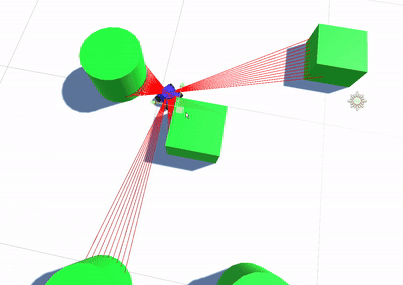

# Mapping-Solution
Simulation of an autonomously navigating robot.
 
Author: Cameron Rosenthal @Supernova1114
 

### Notes
- Robot uses a simulated 2D LIDAR module for mapping.
- Lidar ranging data is fed into a map, which a path planner then runs against.
- Path planning uses an A-Star implementation from: https://github.com/valantonini/AStar

